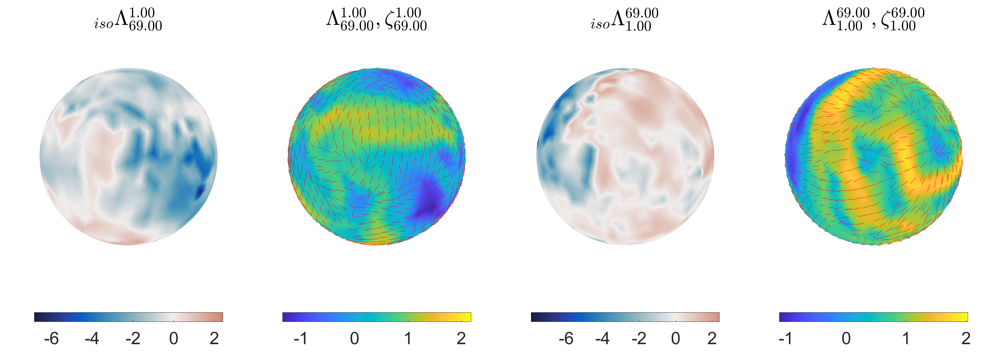

The code for computing FTLE for flow on curved surface are given at [source](https://github.com/SreejithSanthosh/curvedSurfaceFTLE.git). We will provide a detailed tutorial on how to use this code for flow on curved surfaces. To understand the mathematical background and methods used to compute FTLE on curved surface, we refer you to the accompanying manuscript [S. Santhosh et al](Necessary Link).


Please [reach out to us](../Contact) in case of any issues with the code, and we will try to work with you to get it to work for your dataset. 

## Pre-requisites 

The code was built on MATLAB R2023a in a Windows 10 system. We have tested these codes on a *Mac OSX 15* and *Ubuntu 20* operating systems. Since we couldn't test our code on a lot more versions of MATLAB and OS distributions, there could be possible unexpected errors when running this code on other system specifications. We also assume that git is installed and set up in the system, as all the code are set up on GitHub. If not, we refer you to this [link](https://git-scm.com/book/en/v2/Getting-Started-Installing-Git), explaining the same.


## Installation 

To install the code, navigate to the path where you would want to install it on the terminal and clone the github repository using the code 

```
git clone  https://github.com/SreejithSanthosh/curvedSurfaceFTLE.git
```
This will generate a directory called **curvedSurfaceFTLE** which contains all the code. To check if all the necessary components are working, run `mainSingleTimeInterval.m` on MATLAB. This runs the deformation analysis on an example dataset of motion of cells on the pancreatic spheroids given in `./Data/staticMesh.mat` and would present the following result, 



In addition the visalization of the velocity field, forward and backward advection of tracer particles would be given in `/saveResults` directory as `vizVelocity.mp4` , `forAdvct.mp4` and `bckAdvct.mp4` respectively.

Further developement of this code to improve robustness of this method and speed it up is currently ongoing. To get those updates use the command  
```
git pull
```

