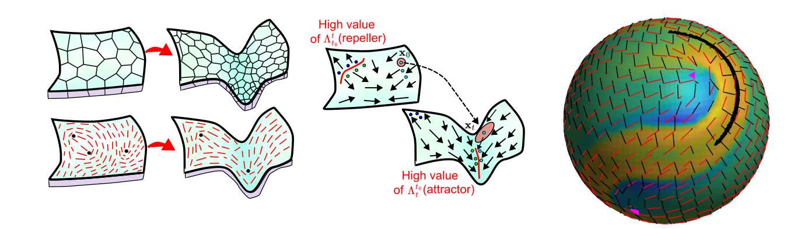
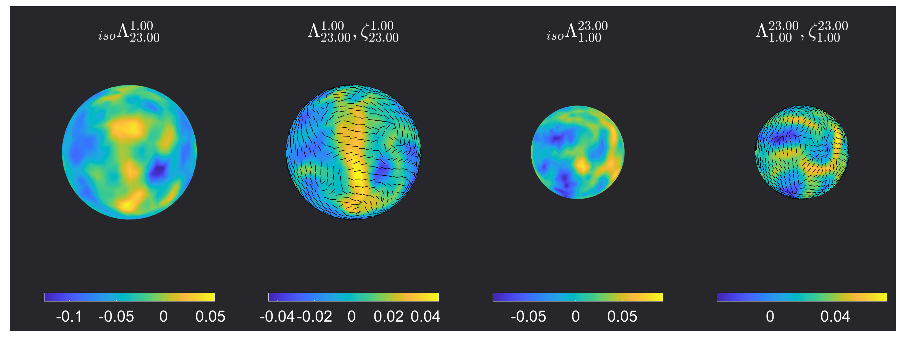
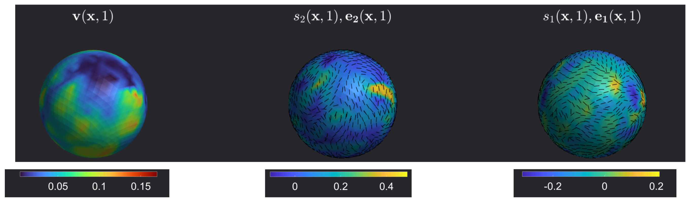

## Lagrangian coherent structures for flows on curved surfaces 

The MATLAB code for computing Coherent Structures based on Finite-Time-Lyapunov Exponents (FTLE) and Lagrangian deformation for flow on curved surfaces is available at this [link](https://github.com/SreejithSanthosh/curvedSurfaceFTLE.git). 
The following tutorial provides instructions on how to use the code. To understand the mathematical background or additional information on the methods discussed here, we refer you to the accompanying manuscript 
[1]. 



### Pre-requisites 

The code was built on MATLAB R2023a in a Windows 10 system. The following MATLAB add-ons need to be installed to run the code, 
- [Parallel Computing Toolbox](https://www.mathworks.com/products/parallel-computing.html) : The code uses parallelization methods provided in this toolbox to run the advection of tracer particles,
- [Lidar Toolbox](https://www.mathworks.com/help/lidar/index.html?s_tid=CRUX_lftnav) : Provides mesh processing capabilities,
- [Computer Vision Toolbox](https://www.mathworks.com/products/computer-vision.html) : Provides mesh processing capabilities.

We have tested these codes on a *Mac OSX 15* and *Ubuntu 20* operating systems. We also assume that Git is installed and set up on the system, as all the code is hosted on GitHub. If not, we refer you to this [link](https://git-scm.com/book/en/v2/Getting-Started-Installing-Git).


### Installation 

To install the code, navigate to the path where you would want to install it on the terminal and clone the GitHub repository using the code 

```
git clone  https://github.com/SreejithSanthosh/curvedSurfaceFTLE.git
```
This will generate a directory called **curvedSurfaceFTLE**, which contains all the code. To check if all the necessary components are working, run `main.m` on MATLAB. This runs the deformation analysis on an synthetic example dataset given in `./Data/growingSphere.mat` and presents the result given below. In addition, the visualization of the velocity field, forward and backward advection of tracer particles would be given in `/saveResults` directory as `vizVelocity.mp4` , `forAdvct.mp4`, and `bckAdvct.mp4` respectively.



The Lagrangian deformation results above are for the time interval $$(t0=1,tf=23)$$. $$\Lambda$$ is the FTLE field, $$\xi$$ is the axis of maximum deformation and $${}_{iso}\Lambda$$  quantifies the isotropic Lagrangian deformation experienced. For further details on these quantities and the algorithm used to compute them, we refer you to the accompanying manuscript [1].

Further development of this code is currently ongoing to improve the robustness of the method and increase its speed. To get those updates, use the command  
```
git pull
```

## Data required for Langrangian analaysis and Formating

To perform the Lagrangian analysis, we require the velocity field $$\mathbf{v}(\mathbf{x},t)$$ that quantifies the material flow on a manifold $$\mathbf{x}\in\mathcal{M}(t)$$. The Lagrangian Analysis method described here applies to both static surfaces, where the manifold is time-independent, and dynamic surfaces, where the manifold is time-dependent. 

  > > **NOTE:** Obtaining velocity data from tissue mechanics and active nematic simulations is relatively simple, but obtaining them from experimental live imaging of biological systems is more difficult. Several methods exist to extract this information, such as [ImSAnE](https://github.com/idse/imsane)  and [TubULAR](https://npmitchell.github.io/tubular/). 


The manifold information $$\mathcal{M}$$ is stored as a mesh with discrete node points $$\mathbf{x}_i = [x_i,y_i,z_i]$$ , where $$i\in\{1,N_p(t)\}$$ and $$N_p(t)$$ is total number of nodes on the manifold at time $$t$$. The connectivity of the mesh is given by a triangulation $$T$$ which is a set of all the mesh faces. Each face $$j\in\{1,N_f(t)\}$$ consists of set of three nodes $$\{i_1,i_2,i_3\}$$ that form face $$j$$. $$N_f(t)$$ denotes the total number of faces on the mesh at time $$t$$. The velocity field is stored as $$\mathbf{v}_i(t)=[v_i^1(t),v_i^2(t),v_i^3(t)]$$ where $$v_i^1(t),v_i^2(t)$$ and $$v_i^3(t)$$ are the x,y and z-component of the velocity at node $$i$$ at time $$t$$.
 
Before you run the Lagrangian analysis, the velocity field data and the manifold on which it is defined need to be stored in a `.mat` file to be read by the MATLAB code, where the variables are 

- time : vector of size ($$1,N_t$$), where $$N_t$$ is the number of time points of the dataset. 
- x : cell array of size ($$N_t,1$$). Each cell array element `x{k}` $$k\in\{1,N_t\}$$ is vector of size $$(N_p(k),1)$$ containing the x-coordinate of all the $$(N_p(k)$$ mesh nodes, where $$N_p(k)$$ is the total number mesh nodes at $$t = k$$. Similarly, the y and z components of the mesh nodes are stored in `y` and `z`. 
- TrianT : cell array of size ($$N_t,1$$). The cell array element `TrianT{k}` $$k\in\{1,N_t\} $$ is a matrix of size $$(N_f(k),3)$$ whose $$j-th$$ raw contains the mesh connectivity of face $$j$$ (e.g. $$[i_1,i_2,i_3]$$ for a mesh face with nodes $$i_1,i_2,i_3$$). $$N_f(k)$$ denotes the number of mesh faces at time $$t = k$$. 
- v : cell array of size ($$3,N_t$$) , where the cell array element `v{1,k}` $$k\in\{1,N_t\}$$ is a matrix of size $$(N_p(k),1)$$ with the x-component of the velocity all the mesh nodes. $$N_p(k)$$ is the total number of mesh nodes at $$t=k$$. Similarly, the y and z components of the velocity are stored in `v{2,k}` and `v{3,k}`. 

An example dataset is provided in `./Data/growingSphere.mat` in the code directory, which can be visualized by running `./Data/vizExampleData.m`.


  > > **NOTE:** An accurate Lagrangian Analysis requires that the mesh representation of the manifold is sampled uniformly, whereby the mesh faces are approximately of equal size; deviation from this may result in spurious results. The finer the mesh faces, the better the accuracy of the advection and deformation computed. If the original data does not meet this requirement, remeshing is recommended.       


### Performing Lagrangian Analysis

We now explain how to run the code `main.m` to compute the Lagrangian deformation information for a chosen time interval $$[t0,tf]$$. 

1. **Load the data** : Once the data is formatted appropriately as described above, it can be loaded onto the script by providing the right path 
```
load(PATH TO THE DATA FILE); Nt = size(time,2);
```
2. **Setting parameters for the simulation** :  A few parameters need to be set depending on the type of data and the system configuration on which you are running the script:  
- ``isStatic``  : should be set to ``isStatic = 1`` if the mesh surface on which the motion happens is time-independent and ``isStatic = 0`` if the mesh changes over time. The code runs faster for static meshes.
- ``cpu_num`` : The code parallelizes the Lagrangian analysis using the [parfor](https://www.mathworks.com/help/parallel-computing/parfor.html) method. Therefore, set this variable to ``cpu_num = Nc ``, where $$Nc$$ is the number of CPU cores available. Note that a copy of the dataset is sent to each core, which may cause the total data in RAM to exceed the system's capabilities. For example, if your data is x GB and you parallelize over Nc cores, the total RAM required is $$ \approx$$ > x * Nc GB.
- Plotting parameters ``Nplot`` and ``fntSz``: ``Nplot`` sets the number of frames that are saved in the video while plotting the advection results. ``fntSz`` similarly sets the font size of the text and elements on those plots.
- Advection parameters ``ct_f`` and ``ct_i`` and ``dt``: If you need to analyze the Lagrangian deformation from $$t=t0$$ to $$t=tf$$, input ``ct_f`` and ``ct_i`` so that ``time(ct_f) = tf`` and ``time(ct_0) = t0``. The parameter ``dt`` is the time-step for advection.
- Regularization parameter ``regulFac`` sets the strength of the regularization used while computing the Lagrangian deformation quantities for noisy velocity fields. For further information we refer you to SI Section S3 in the accompanying manuscript [1].  

3. **Running Code**: After setting the parameters mentioned above, run the code. The code will visualize the velocity data on the surface, forward advection $$t0\to tf$$ and backward advection $$tf \to t0$$ of tracer particles. This will be saved in the ``./SaveResults`` folder. The deformation information will be displayed as a MATLAB plot using the code written in  ``%% Calculate and Visualize the FTLE values``. 

## Eulerian coherent structures for flows on curved surfaces 
The MATLAB code to compute Eulerian coherent structures based on the eigenvalues of the strain rate tensor for flow on curved surfaces is available at this [link](https://github.com/SreejithSanthosh/curvedSurface-OECS.git). The follwing tutorial provides an explanation on how to use the code. 
To understand the mathematical background or additional information on the methods discussed here, we refer the reader to the accompanying manuscript [1].

**Pre-requisites,data-formatting, Installation:** We recommend that users read the tutorial given above for Lagrangian analysis, as the Eulerian code has the same software pre-requisites and data-formatting requirements. To install the code, clone the GitHub repository using the code 
```
git clone  https://github.com/SreejithSanthosh/curvedSurface-OECS.git
```
To ensure that the code works, run the `main.m` script on MATLAB. This script runs the Eulerian analysis on the example dataset given in `./Data/growingSphere.mat` and presents the result below.


The result above visualizes the Eulerian coherent structures at $$t=1$$. The regions with positive high values of the largest eigenvalue of strain rate $$s_2(\mathbf{x},t=1)$$ corresponds to short-time repellers and regions with highly negative values of the smallest eigenvalue of the strain rate $$s_1(\mathbf{x},t=1)$$ corresponds to short-time attractors. The corresponding eigenvectors $$ e_2(\mathbf{x},t=1) $$ and $$ e_1(\mathbf{x},t=1) $$ correspond to the axis of maximum repulsion and attraction rates. 

### Performing Eulerian Analysis

We now explain how to run the code `main.m` to compute the Eulerian coherent structures for a given flow field.
 1. **Load the data** : Once the data is formatted as described above, it can be loaded onto the script by providing the right path 
```
load(PATH TO THE DATA FILE); Nt = size(time,2);
```
2. **Setting parameters for the Eulerian computation** : 
- `regulFac` : Regularization parameter used for estimating the strain-rate. Similar to the regularization parameter in the Lagrangian analysis. 
- `t0`: Sets the time-point to do the Eulerian analysis. 
3. **Running Code**: After setting the above parameters, run the code. The code will visualize the velocity data, the eigenvalues $$(s_1,s_2)$$ and eigenvectors $$(e_1,e_2)$$ of the strain rate at $$t = t0$$.

## References

[1] : Santhosh S., Zhu C., Fencil B., Serra M., preprint (2025), Coherent Structures in Active Flows on Dynamic Surfaces.
