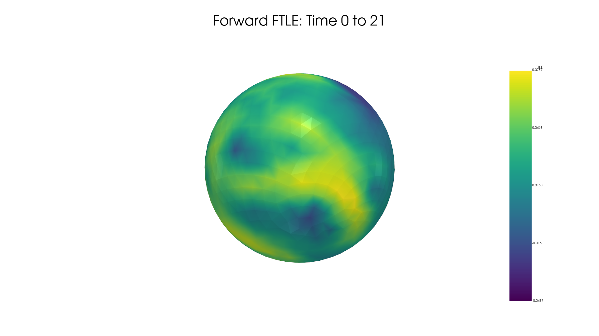

<!-- ---
title: FTLE on Curved Surfaces - Python Implementation 
parent: Tutorial - FTLE codes
layout: home
nav_order: 4
--- -->


## Introduction 

The Python code for computing Coherent Structures based on Finite-Time-Lyapunov Exponents (FTLE) and Lagrangian deformation for flow on curved surfaces is available at this [link](https://github.com/SreejithSanthosh/CurvedSurfacesFTLEPython). The following tutorial provides instructions on how to use the code. To understand the mathematical background or additional information on the methods discussed here, we refer you to the accompanying manuscript [S. Santhosh, C. Zhu, B. Fencil, M. Serra](Necessary Link). [NEED TO WRITE THAT \LAMBDA IS THE FTLE. SIMILAR FOR \LAMBDAISO. WRITE ALSO B_LAMBDA AND F_LAMBDA NEXT TO THE LAMBDA YOU INSERTED NOW]


## Pre-requisites

This code was built in Python 3.11, on a Windows 10 system. The following python packages are needed to run the code: 

- Numpy
- Pyvista
- Scipy
- Matplotlib
- Numba

  
## Installation 

To install the code, navigate to the path where you would want to install it on the terminal and clone the GitHub repository using the command: 

```
git clone  https://github.com/bfencil/CurvedSurfacesFTLEPython.git
```


## Data required for Langrangian analaysis and Formating

To perform the Lagrangian analysis, we require the velocity field $$\mathbf{v}(\mathbf{x},t)$$ that quantifies the material flow on a manifold $$\mathbf{x}\in\mathcal{M}(t)$$. The Lagrangian Analysis method that we describe here works well for both static surfaces, where the manifold on which the flow happens is time-independent, and dynamic surfaces, where the manifold on which the flow happens is time-dependent. 

  > > **NOTE:** Obtaining velocity data from tissue mechanics and active nematic simulations is relatively simple, but obtaining them from experimental live imaging of biological systems is more difficult. Several methods exist to extract this information, such as [ImSAnE](https://github.com/idse/imsane)  and [TubULAR](https://npmitchell.github.io/tubular/). 


The manifold information $$\mathcal{M}$$ is stored as a mesh with discrete node points $$\mathbf{x}_i=[x_i,y_i,z_i]$$ , where $$i\in\{1,N_p(t)\}$$ and $$N_p(t)$$ is total number of nodes on the manifold at time $$t$$. The connectivity of the mesh is given by a triangulation $$T$$ which is a set of all the mesh faces. Each face $$j\in\{1,N_f(t)\}$$ consists of set of three nodes $$\{i_1,i_2,i_3\}$$ that form face $$j$$. $$N_f(t)$$ denotes the total number of faces on the mesh at time $$t$$. The velocity field is stored as $$\mathbf{v}_i(t)=[v_i^1(t),v_i^2(t),v_i^3(t)]$$ where $$v_i^1(t),v_i^2(t)$$ and $$v_i^3(t)$$ are the x,y and z-component of the velocity at node $$i$$ at time $$t$$.
 
Before you run the Lagrangian analysis, the velocity field data and the manifold on which it is defined need to be loaded into the Python file(i.e from a .h5 file) and have the data strucutre:


- Time steps: vector of size ($$1,N_t$$), where $$N_t$$ is the number of time points of the dataset. 
- Node positions : cell array of size ($$N_t,1$$). Each cell array element `x{k}` $$k\in\{1,N_t\}$$ is vector of size $$(N_p(k),1)$$ containing the x-coordinate of all the $$(N_p(k)$$ mesh nodes, where $$N_p(k)$$ is the total number mesh nodes at $$t=k$$. Similarly, the y and z components of the mesh nodes are stored in `y` and `z`. 
- Node connections : cell array of size ($$N_t,1$$). The cell array element `TrianT{k}` $$k\in\{1,N_t\}$$ is a matrix of size $$(N_f(k),3)$$ whose $$j-th$$ raw contains the mesh connectivity of face $$j$$ (e.g. $$[i_1,i_2,i_3]$$ for a mesh face with nodes $$i_1,i_2,i_3$$). $$N_f(k)$$ denotes the number of mesh faces at time $$t = k$$. 
- Node velocities : cell array of size ($$3,N_t$$) , where the cell array element `v{1,k}` $$k\in\{1,N_t\}$$ is a matrix of size $$(N_p(k),1)$$ with the x-component of the velocity all the mesh nodes. $$N_p(k)$$ is the total number of mesh nodes at $$t = k$$. Similarly, the y and z components of the velocity are stored in `v{2,k}` and `v{3,k}`. 

An example dataset is provided in `./Data/growingSphere.h5` in the Python code directory, which can be visualized by running `./Example/Sphere.py`. Running this example for the time frame 0 to 21 for both Forward and Backward FTLE fields we get the following results:





  > > **NOTE:** An accurate Lagrangian Analysis requires that the mesh representation of the manifold is sampled uniformly, whereby the mesh faces are approximately of equal size; deviation from this may result in spurious results. The finer the mesh faces, the better the accuracy of the advection and deformation computed. If the original data does not meet this requirement, remeshing is recommended.


## Performing Lagrangian Analysis

Once you load the data you can run the code by importing the `FTLE_mesh` function form `ftle\Curved\CurvedSurfaceMain.py`. There are several parameters to adjust. 

- `direction` : The direciton of the advection process use `forward` or `backward` for computing the Forward(Repellers) and Backward(Attractors) FTLE-LCS structures repsectiviely. The default value is `forward`.

- `initial_time` , `final_time`: The time index values in $$\{0,1,2,\ldots,T_{final\,time}\}$$ you want the advection process to start from and end at. These values depend on the value of `direction`. If you select `forward` then it is required that `initial_time` < `final_time`. Likewise if `backward` is selected it is required that `initial_time` > `final_time`.
  
- `plot_ftle`: `True`, `False` value for indicating whether to plot the FTLE field over the mesh. The default value is `False`.

- `save_path`: The path to the directory where you want the plot to be saved. The default value is `None`.

- `camera_setup`: This is used for orienting the camera for the save plotting image, this only matters if you choose to specify a `save_path`. This takes in a tuple of the form `(camera_position, camera_focal_point, degree)`. A good `camera_setup` can be determined by running the Analysis for when `plot_ftle` is set to `True`, which allows for the camera details in the plotting window to be printed out to the terminal.

- `neighborhood`: This is the amount of nodes used in the sparse FTLE computations on the mesh. This neighborhood corresponds directly to the amount of nodes about each node of the mesh that go into the FTLE computation. The defualt value is 15.

- `lam`: This is a regularization parameter for the FTLE computations the defualt value is $$10^{-10}$$. There should be no reason to change this value, however meshes that are unusually sparse or dense may require different values. 

## References

[1] : S. Santhosh, C. Zhu, B. Fencil, M. Serra. Coherent Structures in Active Flows on Dynamic Surfaces, pre-print ,(2025)  


