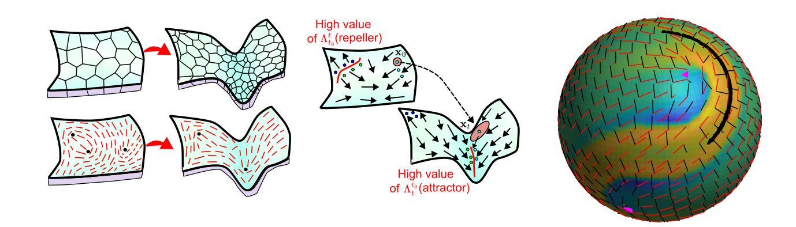
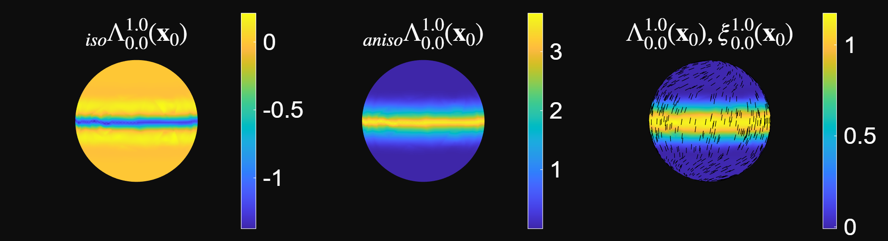
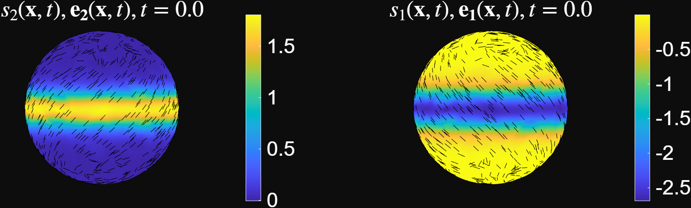

# Lagrangian and Eulerian Coherent Structures for Flows on Curved Surfaces

This tutorial explains how to use the MATLAB code for computing coherent structures (CSs) in flows defined on curved surfaces. The code supports both:

* **Lagrangian coherent structures**, computed using finite-time Lyapunov exponents (FTLEs) and Lagrangian deformation diagnostics.
* **Eulerian coherent structures**, computed from the eigenvalues and eigenvectors of the strain-rate tensor.

The MATLAB code is available in the GitHub repository: [flow_coherent_structure](https://github.com/SreejithSanthosh/flow_coherent_structure.git). For the mathematical background and additional details on the methods, please refer to the accompanying manuscript [1].



## Prerequisites
The code was developed using **MATLAB R2025b** on a Windows 10 system. It has also been tested on:

* macOS 15
* Ubuntu 20

The recommended installation method is through Git, since the code is hosted on GitHub. This tutorial assumes that Git is already installed and configured on your system. If Git is not installed, follow the installation instructions here: [Installing Git](https://git-scm.com/book/en/v2/Getting-Started-Installing-Git)
## Installation

Navigate to the directory where you want to install the code, then clone the GitHub repository:

```bash
git clone https://github.com/SreejithSanthosh/flow_coherent_structure.git
```

This command creates a directory called:

```text
flow_coherent_structure
```

which contains the MATLAB scripts, functions, and example data. To access the code to compute the FTLE compute for flows on curved surfaces, navigate to the folder:

```text
ftle_on_curved_surfac
```

and set it as the root directory in MATLAB. To check that the Lagrangian code is working, run:

```matlab
example_code_lagrangian.m
```

This script loads the example dataset `example_data.mat`, visualizes the velocity field on a deforming sphere, runs the Lagrangian deformation analysis, and displays the results.



The figure above shows the Lagrangian deformation diagnostics computed over the time interval $t_0 = 0\rightarrow t_f = 1$.

Here:

* $\Lambda$ is the FTLE field.
* $\xi$ is the axis of maximum deformation.
* ${}_{\mathrm{iso}}\Lambda$ quantifies the isotropic component of the Lagrangian deformation.
* ${}_{\mathrm{aniso}}\Lambda$ quantifies the anisotropic component of the Lagrangian deformation.

For details on these quantities and the numerical algorithm used to compute them, refer to the accompanying manuscript [1]. The code is under active development. To update your local copy with the latest changes, navigate to the repository directory and run:

```bash
git pull
```

---

## Data Required for CS Analysis

To perform the CS analysis, the code requires a velocity field

$$
\mathbf{v}(\mathbf{x},t)
$$

defined on a manifold

$$
\mathbf{x} \in \mathcal{M}(t).
$$

The method applies to both:

* **Static surfaces**, where the manifold is time-independent.
* **Dynamic surfaces**, where the manifold changes with time.

> **Note:** Velocity data are relatively straightforward to obtain from tissue mechanics simulations and active nematic simulations. Extracting velocity fields from experimental live-imaging data is more challenging. Tools such as [ImSAnE](https://github.com/idse/imsane) and [TubULAR](https://npmitchell.github.io/tubular/) can be used to extract surface geometry and motion from biological imaging data.

---

## Mesh and Velocity Data Format

The manifold $\mathcal{M}(t)$ is represented as a triangular mesh. The mesh consists of discrete node positions $\mathbf{x}_i = [x_i, y_i, z_i],$ where $ i \in {1,2,\dots,N_p(t)}, $ and $N_p(t)$ is the total number of mesh nodes at time $t$. The mesh connectivity is specified by a triangulation $T$, which contains the set of mesh faces. Each face $j \in {1,2,\dots,N_f(t)}$ is defined by three node indices $
{i_1, i_2, i_3},$ which form the triangular face. Here, $N_f(t)$ denotes the total number of mesh faces at time $t$. The velocity field is stored at the mesh nodes as $
\mathbf{v}_i(t) = [v_i^1(t), v_i^2(t), v_i^3(t)], $ where $v_i^1(t)$, $v_i^2(t)$, and $v_i^3(t)$ are the $x$-, $y$-, and $z$-components of the velocity at node $i$ and time $t$. Before running the Lagrangian analysis, the mesh and velocity data must be saved in a `.mat` file readable by MATLAB. The required variables are listed below.

### Required `.mat` Variables

- `mesh_time`: A time vector of size $ 1 \times N_t$ where $N_t$ is the number of time steps.
- `mesh_r`: A cell array of size $ N_t \times 3.$ For each time index $i \in {1,2,\dots,N_t}$:
    * `mesh_r{i,1}` contains the $x$-coordinates of the mesh nodes. `mesh_r{i,2}` contains the $y$-coordinates of the mesh nodes. `mesh_r{i,3}` contains the $z$-coordinates of the mesh nodes. Each entry is a column vector of size $N_q(i) \times 1, $ where $N_q(i)$ is the number of mesh nodes at time index $i$.
- `mesh_F`: A cell array of size $ N_t \times 1.$Each entry `mesh_F{i}` contains the mesh connectivity at time index $i$ as a matrix of size $N_f(i) \times 3,$ where $N_f(i)$ is the number of triangular faces at that time. Each row of `mesh_F{i}` contains the three node indices that define one triangular face.
- `mesh_v`: A cell array of size $N_t \times 3.$For each time index $i \in {1,2,\dots,N_t}$:

    * `mesh_v{i,1}` contains the $x$-component of the velocity.`mesh_v{i,2}` contains the $y$-component of the velocity. `mesh_v{i,3}` contains the $z$-component of the velocity. Each entry is a column vector of size $N_q(i) \times 1, $ where $N_q(i)$ is the number of mesh nodes at time index $i$.

An example dataset, `example_data.mat`, is included in the GitHub repository.

> **Note:** Accurate Lagrangian analysis requires the mesh to sample the manifold approximately uniformly. In particular, mesh faces should be close to equal in size. Strong deviations from uniform sampling can introduce spurious deformation estimates. Finer meshes generally improve the accuracy of both trajectory advection and deformation calculations. If the original mesh does not satisfy these requirements, remeshing is recommended before running the analysis.

---

## Performing the Lagrangian Analysis

To run the Lagrangian analysis on your own dataset:

1. Open the relevant MATLAB script.
2. Load your dataset by replacing the dataset path with the path to your `.mat` file:
```matlab
load('path_to_dataset.mat')
```
3. Set the parameter `delta`. The parameter `delta` specifies the geodesic distance over which deformation is computed. This value should be chosen based on the mesh resolution and the spatial scale over which deformation is to be estimated.
4. Set the time indices `ct0` and `ctf`. These define the time interval over which the Lagrangian analysis is performed.The code computes the Lagrangian deformation diagnostics from `mesh_time(ct0)` to `mesh_time(ctf)`.
5. Run the script. The output includes the FTLE field, principal deformation directions, and isotropic and anisotropic deformation measures.

## Eulerian Coherent Structures for Flows on Curved Surfaces

The same GitHub repository also contains MATLAB code for computing Eulerian coherent structures on curved surfaces. These structures are obtained from the eigenvalues and eigenvectors of the surface strain-rate tensor.

The code is available at: [flow_coherent_structure](https://github.com/SreejithSanthosh/flow_coherent_structure.git). For the mathematical background, refer to the accompanying manuscript [1].

### Prerequisites, Installation, and Data Formatting

The Eulerian code uses the same software requirements, installation procedure, and data format as the Lagrangian code described above. Therefore, users should first follow Sections 1--4 of this tutorial. To test the Eulerian code, run the following MATLAB script:
```matlab
example_code_eulerian.m
```
This script loads `example_data.mat`, runs the Eulerian analysis, and displays the coherent-structure diagnostics.



The figure above visualizes the Eulerian coherent structures at $t=0$. Regions with large positive values of the largest strain-rate eigenvalue, $s_2(\mathbf{x},t),$ correspond to short-time repelling structures. Regions with large negative values of the smallest strain-rate eigenvalue, $
s_1(\mathbf{x},t),$ correspond to short-time attracting structures. The associated eigenvectors have the following interpretations: $\mathbf{e}_2(\mathbf{x},t)$ gives the direction of maximum instantaneous repulsion. $\mathbf{e}_1(\mathbf{x},t)$ gives the direction of maximum instantaneous attraction.

## Performing the Eulerian Analysis

To compute Eulerian coherent structures for a given flow field, open the Eulerian analysis script and follow the steps below.
1. Load the data.After formatting the data as described above, load the `.mat` file in MATLAB:

```matlab
load('path_to_dataset.mat')
Nt = size(mesh_time, 2);
```
2. Set the Eulerian Parameters Set the following parameters:
    * `delta`: regularization parameter used to estimate the surface strain-rate tensor. This plays a role similar to the regularization parameter in the Lagrangian analysis.
    * `ct0`: time index at which the Eulerian analysis is performed. The code computes the Eulerian coherent structures at `mesh_time(ct0)`.
3. Run the Code. After setting the data path and parameters, run the script. The code visualizes:
    * the velocity field,
    * the strain-rate eigenvalues $(s_1,s_2)$,
    * the corresponding eigenvectors $(\mathbf{e}_1,\mathbf{e}_2)$,
    * and the resulting Eulerian coherent-structure diagnostics.

## References

[1] Santhosh, S., Zhu, C., Fencil, B., & Serra, M. (2025). *Coherent Structures in Active Flows on Dynamic Surfaces*. bioRxiv, 2025-05.
