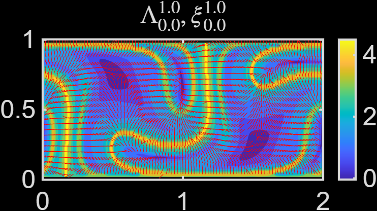
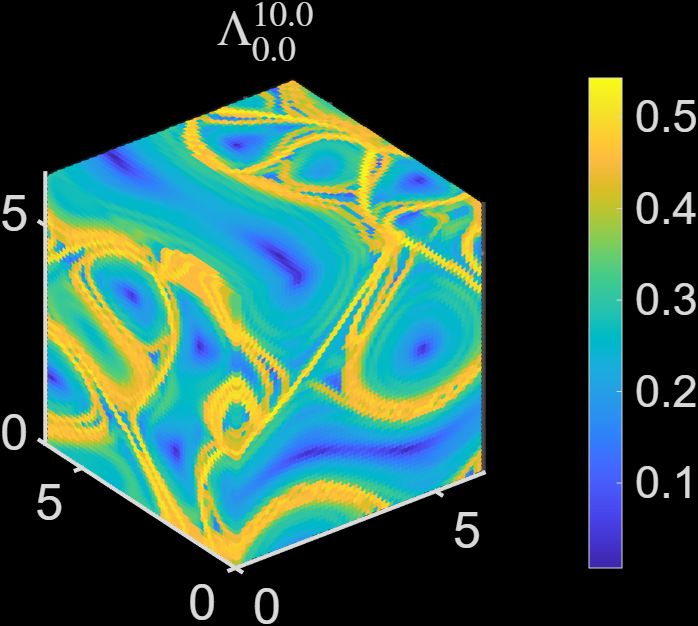

---

title: FTLE from Flows on 2D/3D Euclidean Grids (MATLAB)
parent: Tutorial - FTLE Codes
layout: default
nav_order: 2
---

# Lagrangian Coherent Structures for Flows in 2D/3D Euclidean Spaces

This tutorial explains how to use the MATLAB code for computing finite-time Lyapunov exponent (FTLE) fields for flows defined on 2D and 3D Euclidean grids.

The MATLAB code is available in the GitHub repository:

[flow_coherent_structure](https://github.com/SreejithSanthosh/flow_coherent_structure.git)

The code computes Lagrangian coherent structures by approximating the deformation gradient using finite differences. The FTLE field is then obtained from the singular values of the deformation gradient. The numerical method follows the approach described in [1].

---

## 1. Prerequisites

The code was developed using **MATLAB R2025b** on a Windows 10 system. It has also been tested on:

* macOS 15
* Ubuntu 20

The recommended installation method is through Git, since the code is hosted on GitHub. This tutorial assumes that Git is already installed and configured on your system. If Git is not installed, follow the installation instructions here:

[Installing Git](https://git-scm.com/book/en/v2/Getting-Started-Installing-Git)

---

## 2. Installation

Navigate to the directory where you want to install the code, then clone the GitHub repository:

```bash
git clone https://github.com/SreejithSanthosh/flow_coherent_structure.git
```

This command creates a directory called:

```text
flow_coherent_structure
```

which contains the MATLAB scripts, functions, and example files.

To test the Euclidean-grid FTLE code, navigate to the folder:

```text
ftle_from_euclidean_grid
```

and set it as the root directory in MATLAB.

---

## 3. Example: 2D Double-Gyre Flow

To test the 2D FTLE computation, run the following MATLAB script:

```matlab
example_euclideangrid2d.m
```

This script computes the deformation field and FTLE field for the double-gyre velocity field. The output is shown below.



Here:

* $\Lambda$ is the FTLE field.
* $\xi$ is the axis of maximum deformation.

---

## 4. Example: 3D ABC Flow

To test the 3D FTLE computation, run:

```matlab
example_euclideangrid3d.m
```

This script computes the deformation field and FTLE field for the ABC flow. The output is shown below.



As in the 2D case, the code computes the FTLE field from the deformation of an initially defined grid over a prescribed time interval.

---

## 5. Updating the Code

The code is under active development. To update your local copy with the latest changes, navigate to the repository directory and run:

```bash
git pull
```

---

## 6. Performing Deformation Analysis on Your Own Data

The example scripts are written for specific test flows:

* `example_euclideangrid2d.m` uses the 2D double-gyre flow.
* `example_euclideangrid3d.m` uses the 3D ABC flow.

To apply the analysis to your own velocity field, you must first advect an initial grid from the initial time $t_0$ to the final time $t_f$.

---

## 7. 2D Flow Data Format and Analysis

For a 2D flow, define the initial grid coordinates as:

```matlab
x0, y0
```

After advecting this grid from $t_0$ to $t_f$, the final grid coordinates should be stored as:

```matlab
xf, yf
```

The deformation analysis is performed using:

```matlab
compute_deform_euclidean2d.m
```

This function takes the initial and final grid coordinates,

```matlab
x0, y0, xf, yf
```

and computes the singular values of the deformation gradient, along with the associated deformation axes.

The FTLE field can then be visualized using the plotting section labeled:

```matlab
%% Visualize the result
```

in `example_euclideangrid2d.m`.

---

## 8. 3D Flow Data Format and Analysis

For a 3D flow, define the initial grid coordinates as:

```matlab
x0, y0, z0
```

After advecting this grid from $t_0$ to $t_f$, the final grid coordinates should be stored as:

```matlab
xf, yf, zf
```

The deformation analysis is performed using:

```matlab
compute_deform_euclidean3d.m
```

This function takes the initial and final grid coordinates,

```matlab
x0, y0, z0, xf, yf, zf
```

and computes the singular values of the deformation gradient and the associated deformation axes.

The resulting FTLE field can then be visualized using the visualization section in `example_euclideangrid3d.m`.

---

## 9. Summary of Workflow

The general workflow for computing FTLE fields on Euclidean grids is:

1. Define an initial grid at time $t_0$.
2. Advect the grid through the velocity field from $t_0$ to $t_f$.
3. Store the final grid positions at time $t_f$.
4. Use the appropriate deformation-analysis function:

   * `compute_deform_euclidean2d.m` for 2D flows.
   * `compute_deform_euclidean3d.m` for 3D flows.
5. Compute the singular values of the deformation gradient.
6. Visualize the FTLE field and the corresponding deformation axes.

---

## References

[1] Haller, G. (2015). Lagrangian coherent structures. *Annual Review of Fluid Mechanics*, 47(1).
