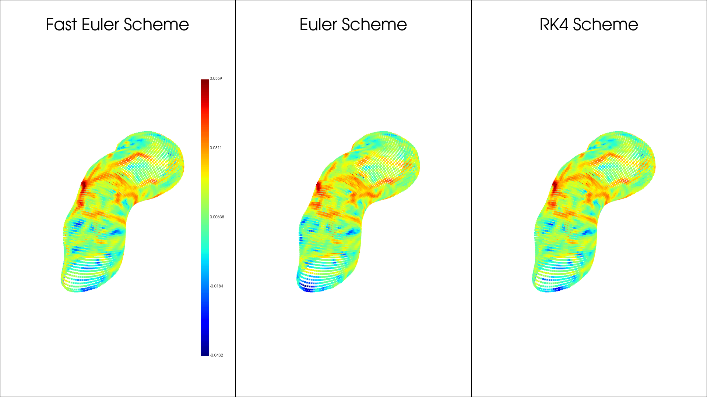

The python package for computing the coherent structures and Lagrangian deformation for flow on a curved surface is given in this [link](https://github.com/bfencil/ftlePackage). To understand the mathematical background or additional information on the methods discussed here, we refer you to the accompanying manuscript [S. Santhosh et al](Necessary Link).


## Installation 

To install the python package you can use the following command in your python environment:

```
pip install -e https://github.com/bfencil/ftlePackage.git#egg=ftlePackage
```


## Data required for Langrangian analaysis and Formating


The manifold information $$ \mathcal M $$ is stored as a mesh with discrete node points $$ \mathbf{x}_i = (x_i,y_i,z_i) \in \mathcal{R}^3$$ , where $$ i \in \{0,,1, cdots, N_t\}$$ and $$N_t)$$ is total number of nodes on the manifold at time step $$t$$. The connectivity of the mesh is given by a triangulation $$ T $$ which is a set of all the mesh faces. Where a face is defined by being a set of three node positions. Which for say face $$ f \in \{0,1, \cdots , F_t\}$$ would be another set of three vertices $$ \{i_1,i_2,i_3\}$$ for $$ i_1,i_2,i_3 \in \{0,1,\cdots,N_p(t)\}$$ are the indices of the nodes that form face $$ f $$, where $$F_t$$ is the total number of faces on the mesh at time $$t$$. The velocity field is stored as $$v_p(t) = (v_p^1(t),v_p^2(t),v_p^3(t)) $$ where $$v_p^1(t),v_p^2(t)$$ and $$v_p^3(t)$$ are the x,y and z-component of the velocity at node $$p$$ at time $$t$$.
 
The data for the mesh must be stored like so:

- node positions : an array of dimensions (node_number, 3) , which in the first, second, and third columns are the x,y,z coordinates respectively, and each row corresponds to a node index. For time dependent data it must be stored as (node_number, 3, total_time).


- node connections : cell array of size ($$ N_t,1$$), where the cell array element `TrianT{i}` $$i\in \{1,N_t\} $$ is a double array of size $$(N_f(i),3)$$ with mesh connectivity (For example, $$[i_1,i_2,i_3] $$ for a mesh face with nodes $$i_1,i_2$$ and $$i_3$$) are appended along the rows, where $$N_f(i)$$ is the total number of mesh faces on the manifold at $$t = i$$. Node connections will always be assumed to be constant in time.


- time steps: an array of dimensions (total time steps), where each time step is a non-negative integer.

- node velocities : an array of dimensions (node_number, 3) , which in the first, second, and third columns are x,y,z velocities respectively, and each row corresponds to a node index. Note that these velocities do not need to be tangent to the mesh, as we are consider both the normal velocity field and the tangent velocity field. In simple terms the normal velocity field causes movement of the mesh, while the tangent velocity field causes points to move along the mesh surface. For time dependent data it must be stored as (node_number, 3, total_time).


## Performing Lagrangian Analysis for a Single Time Interval


Onece the data has been formatted correctly and loaded. The entiretity of the analysis can be done through the run_simulation function. Which has a few paramters. 

**Setting Parameters for the simulation**: 

The first paramters are the ``initial_time`` and ``final_time`` parameters, which control over what interval of your time stpes you want the simulation to cover, in general you want final_time to be greater than initial_time. 

The next parameter is ``direction`` which can be set to either "forward" or "backward", for the forward and backward advection respectively. If you backward is selected then your final_time and initial_time are swapped so final_time should be less than initial_time.

The next parameter is the ``scheme_type`` which allows you to select between three different advection schemes. The first scheme is Forward-Backward Euler(selected as "euler"), as the name implies this is a combination of the standard Forward Euler and Backward Euler schemes. What Forward-Backward Euler does specifically is that it alternates the use of the forward and backward part per time step. This creates a scheme that almost completly preserves energy due to the energy increase in Forward Euler cancelling out with the energy decrease in Backward Euler. 

The second scheme is what will be called Fast Euler(selected as "fasteuler"). This scheme uses Forward Euler but only projects points to the mesh and gets interpolated velocity values every other time step. Resulting in additional error terms that help to cancel out the error terms of Forward Euler. 

The last scheme is jsut Runge-Kutta 4(selected as "rk4"). These schemes all perform comparable to each other in terms of accuracy, but have some important differences. Firstly the RK4 scheme perfomrs the best for large time steps in terms of accuracy and speed. However for small time steps(<0.2) we have that Fast Euler is just as accurate as the RK4 and can run in well under half the time RK4 does. In general Forward-Backward Euler is the least accurate of the three but only by a small margin and recovers the same primary Lagragian Coherent Structures as the other two. The advantage of Forward-Backward Euler is that it is more accurate at very small time steps(on the order of 0.001 and lower) than Fast Euler and RK4, and is also slightly faster than RK4 for small time steps.

The other parameters are ``node_positions``, ``node_velocities``, ``time_steps``. Along with a time step parameter ``dt`` used to control how many steps are inbetween the primary time steps. The final paramters of concern are ``neighborhood`` and ``lam`` which are both used for sparse FTLE computations and are by default 15 and && 10^{-10} &&.


## Centroids(Barycenters) ##

Using the center point of a face, the centroid, in our mesh is quite convenient as will be seen in the documentation for other sections of the code. To find the centroid of a face $$f = \{x_1,x_2,x_3\} we simply take the average of the positions that make up the face, so the centroid && C_f && is given by: && C_f = \frac{x_1 + x_2 + x_3}{3} &&. We compute centroids in this code:

```
def compute_centroids(node_connections, node_positions):
    """
    Computes the centroids of triangles defined by `node_connections` over all time steps.

    Parameters:
        node_connections (ndarray): (M, 3) array of node indices defining each triangle.
        node_positions (ndarray): (N, 3, T) array of node positions, where:
                                  - N = number of nodes,
                                  - 3 = spatial coordinates (x, y, z),
                                  - T = number of time steps.

    Returns:
        centroids (ndarray): (M, 3, T) array of computed centroids over time.
    """

    return (node_positions[node_connections[:, 0], :, :] + node_positions[node_connections[:, 1], :, :] + node_positions[node_connections[:, 2], :, :]) / 3.0
```

This computation is done at the begining of the advection process so it does not need to be computed by the user. The advantage of computing centroids, is that they give a more consistent way of finding the closest face to project particles onto when they leave the mesh.


## Mesh Position and Velocity Interpolation ##

For a mesh with time dependent positions, we can interpolate the positions of the mesh between time steps $$ t_i ## and ## t_{i+1} ## to get the fractional mesh positions inbetween. In our implementation this is done by a simple linear interpolation by the function:

```
def interpolate(initial_data, later_data, t_fraction):

    return t_fraction * initial_data  + (1-t_fraction) * later_data

```

This interpolation happens on the fly during the particle advection. This helps to strave off memory issues for small ``dt``, since the other interpolation option is to precompute your values and store them. Which for a large mesh and a very small ``dt`` can cause memory problems. 

Likewise for time dependent velocities, the same interpolation process is done per node.

## Velocity Interpolation ## 

For the particle advection your particles will lie in places where the mesh velocity field is not defined. To get a defined velocity at any point of the mesh we do a barycentric interpolation. That is for a point && p && of our mesh that lies in some face && f = \{x_1,x_2,x_3\} &&, we use weighted sums of the distances between &&x_1,x_2,x_3 $$ to &&p&& to compute the interpolated velocity at &&p &&p from the velocities &&v_{x_1}, v_{x_2}, v_{x_3} $$. Here is the code for this process:

```
def get_velocity(particle_positions, faces, node_positions, node_velocities, face_indices):
    """
    Gets the velocity as a specific position by interpolation of the surrounding
    node velocites.

    Parameters: 
    particle_positions: position of particle
    faces: faces of the simplicial complex
    face_indices: Inidices of the faces 
    node_positions: the vertex positions of the mesh
    node_velocities: the velocities at each vertex
    """

    particle_faces = faces[face_indices, :]

    # Extract node positions and velocities for each particle's corresponding face
    A = node_positions[particle_faces[:, 0], :]
    B = node_positions[particle_faces[:, 1], :]
    C = node_positions[particle_faces[:, 2], :]

    v0 = node_velocities[particle_faces[:, 0], :]
    v1 = node_velocities[particle_faces[:, 1], :]
    v2 = node_velocities[particle_faces[:, 2], :]

    # Compute vectors relative to A
    v2_1 = B - A
    v2_2 = C - A
    v2_particle = particle_positions - A

    # Compute the dot products needed for barycentric coordinates
    d00 = np.einsum('ij,ij->i', v2_1, v2_1)
    d01 = np.einsum('ij,ij->i', v2_1, v2_2)
    d11 = np.einsum('ij,ij->i', v2_2, v2_2)
    d20 = np.einsum('ij,ij->i', v2_particle, v2_1)
    d21 = np.einsum('ij,ij->i', v2_particle, v2_2)

    # Compute the barycentric coordinates
    denom = d00 * d11 - d01 * d01
    v = (d11 * d20 - d01 * d21) / denom
    w = (d00 * d21 - d01 * d20) / denom
    u = 1.0 - v - w

    # Interpolate the velocities at the particle positions
    interpolated_velocities = u[:, np.newaxis] * v0 + v[:, np.newaxis] * v1 + w[:, np.newaxis] * v2

    return interpolated_velocities

```


## Mesh Projections ##

When advecting particles on a mesh the particles will be moved off the mesh due to movement induced by the velocity vectors. For a point %% p_1 %% in our mesh at && t_i && that is advected by && v_{p_1} && to some point &&p_2 && at time &&t_{i+1}&&. We first use a KDTree from the scipy.spatial library to construct a KDTree of the centriods at time && t_{i+1} && then we query this tree for the closest centroid, and project &&p_2 && onto the tangent plane defined by the face of this centroid. The first thing to note about this method, is that it is not garuanteed to project the point directly onto the face, just ont the tangent plane of the face. So the projected point can still not be not on the mesh. While this may seem like a problem, it actually is not a problem. For smaller and smaller time steps you are more likely to project the particle directly onto the mesh, while for large time steps(>&&\approx 0.5) you are less likely to project onto the mesh. This is fine since for large time steps the simulation will not be very accurate anyway, and getting rid of excess KDTree searchs makes the particle advection for smaller time steps run faster than if you were to search accuratly every time. Here is the particle projection code:

```
def particle_projection(node_connections, kdtree, particle_positions, node_positions):
    """
    Simplified particle projection: Projects all particles to the first closest centroid face.
    
    Parameters: 
    TrianT: The vertex connections (Nx3 array, each row contains the indices of the vertices forming a face)
    kdtree: KDTree built from the centroids of TrianT
    particle_positions: The positions of particles to project (Mx3 array)
    node_positions: The vertex positions of the mesh (Px3 array)
    
    Returns:
    new_positions: Projected positions of the particles
    centroid_indices: Indices of the closest centroids used for projection
    """

    # Query the nearest centroid for each particle
    _, indices = kdtree.query(particle_positions, k=1)
    
    # Retrieve the corresponding faces
    nearest_faces = node_connections[indices]
    
    # Extract the vertices of the nearest faces
    A = node_positions[nearest_faces[:, 0]]
    B = node_positions[nearest_faces[:, 1]]
    C = node_positions[nearest_faces[:, 2]]

    # Perform vectorized projection for all particles
    def project(A, B, C, P):
        """Projects point P onto the plane defined by triangle (A, B, C)"""
        normal = np.cross(B - A, C - A)
        normal /= np.linalg.norm(normal, axis=1, keepdims=True)
        vector_to_plane = A - P
        distance = np.einsum('ij,ij->i', vector_to_plane, normal)
        return P + distance[:, None] * normal

    # Compute the new positions
    new_positions = project(A, B, C, particle_positions)
    
    return new_positions, indices

```

The simplier projection scheme also allows for increased optimaziation due to not having to evaulate logical conditionals for checking if a projected point is actually in the face of the closest centroid.


### FTLE Computations ###

After the trajectories have been computed they are passed to ``FTLE_Compute``, which computes FTLE values by a sparse method disscussed .....[place something here].... . The sparse FTLE method usually requires adjusing a radius parameter which controls how many points are factored into the neighborhood around the point of concern. This means that for a very high particle densisty you must adjust the radius to be very small or else the computations will take too long. Likewise for a very low particle densisty you need to adjust the radius to be much larger. To avoid this problem we can use a KDTree constructed from our particles to find the 15 nearest other particles, and just treat those 15 particles as being in our neighborhood of our point. This treatment will work quite well for most meshes, but if your mesh is too large or too small adjustment will be required, which is given by ``neighborhood`` parameter. Which by default as a value of 15. Finally to compute the FTLE value for a point && p && after we have selected our neighborhood points. We need to project the neighborhood points onto the tangent plane associated with && p &&. This is to ensure that the deformation defined by the Cauchy Green Strain tensor is still relative to the tangent space of our underlying smooth manifold. This projection process is done with the ``local_tangent_project`` function: 


```

@njit
def local_tangent_project(A, B, C, position):
    """
    Project the current position to the plane formed by points A, B, C

    Parameters:
    A, B, C: Points in R^3
    position: The point to project onto the ABC plane, assuming it's already on the plane

    Returns:
    x_local: The coordinates of the position in the local tangent plane
    """
    vec1 = B - A
    vec2 = C - A

    # Normalize the vectors to form an orthonormal basis (this assumes vec1 and vec2 are not collinear)
    vec1 = vec1 / np.linalg.norm(vec1)
    vec2 = vec2 - np.dot(vec2, vec1) * vec1  # Orthogonalize vec2 with respect to vec1
    vec2 = vec2 / np.linalg.norm(vec2)

    # Calculate the vector from A to the position
    vec3 = position - A

    # Project vec3 onto the vectors
    return np.array([np.dot(vec3, vec1), np.dot(vec3, vec2)])

```

Here is also the ``FTLE_compute`` function:
```

def FTLE_compute(node_connections, node_positions, centroids, initial_positions, final_positions, initial_time,  final_time, neighborhood = 15, lam=1e-10):

    """
    Computes the Finite Time Lyaponov Exponent, for sparse data input

    Parameters:
    node_positions: Positions of the simplicial complex vertices
    particle positions: Kdtree of the particle positions
    centroids: Centroid of each face
    initial_positions: Initial Positions, dimensions (number of positions, 3)
    final_positions: Final Positions, dimensions (number of positions, 3)
    TrianT: Connections of vertices
    lam: Regularity constant
    
    Returns:
    FTLE: Finite Time Lyaponov Exponent 
    """

    position_kdtree = cKDTree(initial_positions)
    centroid_kdtree = cKDTree(centroids)

    number_points = initial_positions.shape[0]


    FTLE = np.zeros(number_points)
    for i in range(number_points - 1):
        
        # Get Initial position data
        _, closest_indexes = position_kdtree.query(initial_positions[i,:], 5)
        _, tangent_face_index = centroid_kdtree.query(initial_positions[i,:], 1)  
        Iclosest_positions = initial_positions[closest_indexes[1:]]
        Itangent_face = node_connections[tangent_face_index, :]
        Itangent_face_positions = node_positions[Itangent_face, :]


       
        # Get Final position data
        Fclosest_positions = final_positions[closest_indexes[1:], :]
        _, Ftangent_face_index = centroid_kdtree.query(final_positions[i, :], 1)
        Ftangent_face = node_connections[Ftangent_face_index, :]
        Ftangent_face_positions = node_positions[Ftangent_face, :]

        # Arrays for storing positions with respect to the tangent plane
        Ilocal_tangent_coords = np.zeros((Iclosest_positions.shape[0], 2))
        Flocal_tangent_coords = np.zeros((Iclosest_positions.shape[0], 2))

        # Local tangent plane coordinates
        for j in range(Iclosest_positions.shape[0]):
            Ilocal_tangent_coords[j,:] = local_tangent_project(Itangent_face_positions[0, :],
                                            Itangent_face_positions[1, :],
                                            Itangent_face_positions[2, :], 
                                            Iclosest_positions[j, :])
            
            Flocal_tangent_coords[j,:] = local_tangent_project(Ftangent_face_positions[0, :],
                                Ftangent_face_positions[1, :],
                                Ftangent_face_positions[2, :], 
                                Fclosest_positions[j, :])

        combs = list(combinations(range(len(closest_indexes[1:])),2))
        
        ind1 = [comb[0] for comb in combs]
        ind2 = [comb[1] for comb in combs]

        X = np.zeros((2, len(combs)))
        Y = np.zeros((2, len(combs)))
        X[0, :] = Ilocal_tangent_coords[ind1, 0] - Ilocal_tangent_coords[ind2, 0]
        X[1, :] = Ilocal_tangent_coords[ind1, 1] - Ilocal_tangent_coords[ind2, 1]
        Y[0, :] = Flocal_tangent_coords[ind1, 0] - Flocal_tangent_coords[ind2, 0]
        Y[1, :] = Flocal_tangent_coords[ind1, 1] - Flocal_tangent_coords[ind2, 1]

        # Least square fit of flow map gradient
        A = Y@X.T + lam*max(1,len(closest_indexes))*np.eye(2)
        B = X@X.T + lam*max(1,len(closest_indexes))*np.eye(2)
        DF = A@np.linalg.inv(B)
        
        # Calculate FTLE as the largest singular value of DF
        FTLE[i] = np.log(np.linalg.norm(DF,2)) / abs(final_time -initial_time)

    return FTLE

```


### run_simulation ##

The ``run_simulation`` function is the only function that needs to be run for the FTLE values for your mesh to be computed. In the current implementation, if your ``node_positions`` or ``node_velocity`` are not time dependent and are given to ``run_simulation`` without the time index. The data will for the constant time data will be copied and appended to a new third axis dimension creating an artificial time dimension. Here is the full ``run_simulation`` code:


def run_simulation(node_connections, node_positions, node_velocities, particle_positions, initial_time, final_time, time_steps, dt, direction, scheme_type, neighborhood = 15, lam=1e-10):
    """
    Runs a particle advection simulation on a 2D surface embedded in 3D space.

    This function simulates the movement of particles over a triangulated mesh using 
    different numerical advection schemes. It supports both forward and backward advection 
    and computes the Finite-Time Lyapunov Exponent (FTLE) field.

    Parameters:
        node_connections (ndarray): 
            (M, 3) Connectivity matrix defining the mesh topology, where each row 
            represents a triangle formed by three node indices.

        node_positions (ndarray): 
            (N, 3, T) or (N, 3) Array containing the (x, y, z) positions of each node over time.
            If time-dependent, it should have shape (N, 3, T), otherwise, it will be expanded.

        node_velocities (ndarray): 
            (N, 3, T) or (N, 3) Array containing velocity vectors at each node.
            If not time-dependent, it will be expanded to (N, 3, T).

        particle_positions (ndarray): 
            (P, 3) Initial positions of the particles in 3D space.

        initial_time (int): 
            Index of the initial time step.

        final_time (int): 
            Index of the final time step.

        time_steps (ndarray): 
            (T,) Array of available time steps.

        dt (float): 
            Time step size for numerical integration. Must be in the range (0,1].

        direction (str): 
            Specifies whether the advection is "forward" or "backward" in time.

        scheme_type (str): 
            Specifies the numerical integration scheme:
            - "euler": Standard Euler method.
            - "fasteuler": Optimized Euler method.
            - "rk4": Fourth-order Runge-Kutta method.

        neighborhood (int, optional): 
            Number of neighboring nodes to consider when computing FTLE. Default is 15.

    Returns:
        Ftle (ndarray): 
            (N,) or (P,) Array of FTLE values computed at the particle positions.

    Raises:
        ValueError: If input parameters are inconsistent or invalid.
        RuntimeError: If trajectory computation or FTLE calculation fails.

    Notes:
        - If node_positions or node_velocities are time-independent (i.e., shape (N,3)), 
          they are expanded to (N,3,T) by copying across time steps.
        - The function supports both forward and backward advection, with time 
          adjustments for backward mode.
        - Particle trajectories are computed using the chosen advection scheme, and 
          FTLE values are calculated based on initial and final particle positions.
    """

    total_time = len(time_steps)
    
    # Ensure node_positions is [total_nodes, 3, total_time]
    if node_positions.ndim == 2:  # Shape [total_nodes, 3]
        node_positions = np.tile(node_positions[:, :, np.newaxis], (1, 1, total_time))

    # Ensure node_velocities is [total_nodes, 3, total_time]
    if node_velocities.ndim == 2:  # Shape [total_nodes, 3]
        node_velocities = np.tile(node_velocities[:, :, np.newaxis], (1, 1, total_time))


    direction = direction.lower()
    scheme_type = scheme_type.lower()

    # Time consistency checks
    if initial_time not in time_steps:
        raise ValueError("Error: Initial time must be in the given time values")
    if final_time not in time_steps:
        raise ValueError("Error: Final time must be in the given time values")
    if initial_time == final_time:
        raise ValueError("Error: Initial time and final time for advection should be different")

    if direction == "forward":
        if initial_time > final_time:
            raise ValueError("Error: Forward advection final time must be greater than the initial time")
    elif direction == "backward":
        if initial_time < final_time:
            raise ValueError("Error: Backward advection initial time must be greater than the final time")

        # Adjust times for indexing in backward advection, and acount for time reversal in backward schemes
        temp_initial_time = len(time_steps) - final_time - 1
        final_time = len(time_steps) - initial_time  - 1
        initial_time = final_time
        final_time = temp_initial_time
        

    else:
        raise ValueError("Error: Specify a direction for the particle advection: 'forward' or 'backward'.")

    if dt > 1 or dt <= 0:
        raise ValueError("Error: The value dt must be in the interval (0,1]")


    # Advection scheme processing
    x_traj, y_traj, z_traj = None, None, None  # Initialize as None

    if direction == "forward":
        if scheme_type == "euler":
            x_traj, y_traj, z_traj, centroids = forward_particle_advection(
                node_connections, node_positions, node_velocities, particle_positions, initial_time, final_time, dt
            )
        elif scheme_type == "fasteuler":
            x_traj, y_traj, z_traj, centroids = fast_forward_particle_advection(
                node_connections, node_positions, node_velocities, particle_positions, initial_time, final_time, dt
            )
           # plot_particle_trajectories(x_traj, y_traj, z_traj, len(x_traj[0,:]))

        elif scheme_type == "rk4":
            x_traj, y_traj, z_traj, centroids = RK4_forward_particle_advection(
                node_connections, node_positions, node_velocities, particle_positions, initial_time, final_time, dt
            )
        else:
            raise ValueError("Error: Specify a scheme for the particle advection: 'euler', 'fasteuler', or 'rk4'.")

    elif direction == "backward":
        if scheme_type == "euler":
            x_traj, y_traj, z_traj, centroids = backward_particle_advection(
                node_connections,
                node_positions, node_velocities, particle_positions, initial_time, final_time, dt
            )
        elif scheme_type == "fasteuler":
            x_traj, y_traj, z_traj, centroids = fast_backward_particle_advection(
                node_connections,
                node_positions, node_velocities, particle_positions, initial_time, final_time, dt
            )
        elif scheme_type == "rk4":
            x_traj, y_traj, z_traj, centroids = RK4_backward_particle_advection(
                node_connections,
                node_positions, node_velocities, particle_positions, initial_time, final_time, dt
            )
        else:
            raise ValueError("Error: Specify a scheme for the particle advection: 'euler', 'fasteuler', or 'rk4'.")

    # Check if trajectory values are None
    if x_traj is None or y_traj is None or z_traj is None:
        raise RuntimeError("Error: Particle trajectory computation returned None. Check the computation functions.")

    # Compute FTLE
    Ftle = FTLE_compute(
        node_connections,
        node_positions[:,:, initial_time],
        centroids[:,:, initial_time],
        particle_positions,
        np.vstack([x_traj[:, -1], y_traj[:,-1], z_traj[:, -1]]).T,
        initial_time,
        final_time,
        neighborhood
    )

    if Ftle is None:
        raise RuntimeError("Error: FTLE computation returned None.")

    return Ftle


## Example Computations ## 

For ease of plotting the FTLE values on your mesh as colormap, it is easiest to have your initial particles be the node positions then you can directly use your mesh structure. As is done here:

```
# Color bar settings
scalar_bar_args = {
    "vertical": True,            # Vertical color bar
    "title_font_size": 12,        # Title size
    "label_font_size": 10,        # Label size
    "n_labels": 5,                # Reduce the number of tick labels
    "position_x": 0.85,           # Adjust position in subplot
    "position_y": 0.1,            # Adjust position in subplot
    "width": 0.1,                 # Adjust width
    "height": 0.7                 # Adjust height
}

# Create PyVista mesh
surf = pv.PolyData(node_positions[:, :, 0])  # Use first time step positions
faces = np.hstack((np.full((mesh_data['node_cons'][0].shape[0], 1), 3), mesh_data['node_cons'][0])).flatten()
surf.faces = faces

# Assign scalar FTLE values
surf['fastFTLE'] = fast_fftle
surf['FFTLE'] = fftle
surf['Rfftle'] = Rfftle

surf.compute_normals(cell_normals=False, point_normals=True, feature_angle=45, inplace=True)

# Plot settings
smooth_interpolation = True
plot_kwargs = dict(smooth_shading=True, show_edges=False, ambient=0.5, diffuse=0.6, specular=0.3)

# Initialize PyVista plotter with 3 subplots
window_size = (1920, 1080)
pl = pv.Plotter(shape=(1, 3), off_screen=False, window_size=window_size)

# === SUBPLOTS ===
pl.subplot(0, 0)
pl.add_mesh(surf, scalars='fastFTLE', cmap='jet', interpolate_before_map=smooth_interpolation, scalar_bar_args=scalar_bar_args, **plot_kwargs)
pl.add_title('Fast Euler Scheme')

pl.subplot(0, 1)
pl.add_mesh(surf, scalars='FFTLE', cmap='jet', interpolate_before_map=smooth_interpolation, scalar_bar_args=scalar_bar_args, **plot_kwargs)
pl.add_title('Euler Scheme')

pl.subplot(0, 2)
pl.add_mesh(surf, scalars='Rfftle', cmap='jet', interpolate_before_map=smooth_interpolation, scalar_bar_args=scalar_bar_args, **plot_kwargs)
pl.add_title('RK4 Scheme')

pl.show()

```

For an exmaple of how this looks, using a data of a zebra fish heart, for ``dt`` && = 0.1 && here is a pyvista plot of the forward FTLE values computed for all three schemes: 


Alternatively, you could plot the scatter plot of the points and assign a color map:

```
scalar_bar_args = {
    "vertical": True,
    "title_font_size": 12,
    "label_font_size": 10,
    "n_labels": 5,  # Reduce number of labels
    "position_x": 0.85,  # Adjust position
    "position_y": 0.1,
    "width": 0.1,
    "height": 0.7
}

# Extract node positions (first time step)
points = node_positions[:, :, 0]  

# Initialize PyVista Plotter with 3 subplots
window_size = (1920, 1080)
pl = pv.Plotter(shape=(1, 3), off_screen=False, window_size=window_size)

# === SUBPLOTS ===
pl.subplot(0, 0)
pl.add_points(points, scalars=fast_fftle, cmap='jet', point_size=5.0, scalar_bar_args=scalar_bar_args)
pl.add_title('Fast Euler Scheme')


pl.subplot(0, 1)
pl.add_points(points, scalars=fftle, cmap='jet', point_size=5.0, scalar_bar_args=scalar_bar_args)
pl.add_title('Euler Scheme')

pl.subplot(0, 2)
pl.add_points(points, scalars=Rfftle, cmap='jet', point_size=5.0, scalar_bar_args=scalar_bar_args)
pl.add_title('RK4 Scheme')

pl.show()

```



