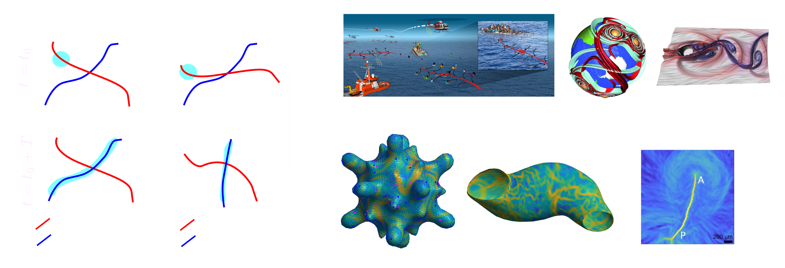
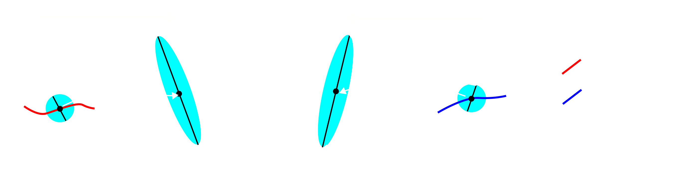

## What are Coherent Structures?

Coherent Structures are persistent, robust structures in a flow that summarize complex fluid trajectories and material deformations [1]. Lagrangian Coherent Structures (LCSs) [1] summarize material transport over a finite time interval and are computable from fluid trajectories. Eulerian Coherent Structures [2], on the other hand, quantify short-time material transport and are computable from single snapshots of the velocity field. There exist different types of Coherent Structures and different methods for computing them from velocity or trajectory flow data (see, e.g., [3]). Here, we focus on Attracting and Repelling Coherent Structures---special surfaces in 3D flows or curves in 2D flows where nearby tracer particles maximally converge or separate. We identify Attracting and Repelling Coherent Structures based on the Finite Time Lyapunov Exponent (FTLE) [4,5] and instantaneous Lyapunov Exponents [6] fields, which are the most common due to their simplicity and straightforward visualization. 

<figure>

<figcaption>(a) Deformation of a fluid patch close to a saddle point (i.e., a fixed point) of a steady (i.e., time independent) velocity (left), and to Attracting and repelling LCSs in an unsteady (i.e., time dependent) velocity (right). Attracting and Repelling Coherent Structures are special surfaces in 3D flows or curves in 2D flows where nearby tracer particles maximally converge or separate. (b-i) Examples of Coherent Structures in physical and biological flows. (b) Short-time attractors (or Attracting Eulerian Coherent Structures) aid search and rescue operations at sea [7]. (c-d) Attracting and Repelling LCSs in (c) atmospheric flows [8] and (d) CFD flows for a cylinder wake [9]. (e) FTLE and Attracting LCSs in active nematic flows [10]. (f) FTLE and Attracting LCSs in a beating zebrafish heart [10]. (g) FTLE and Attracting LCSs in multicellular flows during avian gastrulation [11].</figcaption>
 </figure>

## Why is coherent structure identification useful?
Consider the flow field around a saddle point (Panel (a)): a nearby patch of fluid (cyan) converges to the fixed point along its stable manifold (red curve) and separates along the unstable manifold (blue curve). Stable and unstable manifolds of saddle points, however, have important limitations: i) are meaningful only in steady velocities ($$\mathbf{v}(\mathbf{x})$$); ii) describe the evolution of material patches only in the infinite-time limit (not over finite or short times); iii) are static (do not deform/move in time). Repelling and Attracting LCSs generalize stable and unstable manifolds of fixed points, overcoming the above limitations. i) They are computable for both steady and unsteady ($$\mathbf{v}(\mathbf{x},t)$$) velocity fields; ii) they shape material patches over the desired time interval of interest $$[t_0, t]$$; iii) they are dynamic (move and deform over time); iv) they reveal regions on the flow with the highest Lagrangian deformations; v) they are objective; i.e., invariant to time-dependent rotations and translations of the coordinate system used to describe motion. 

Overall, Repelling and Attracting LCSs provide a reduced representation of a temporally and spatially varying flow, enabling robust quantification of complex and noisy velocity datasets, a systematic comparison between flows in different experiments and comparisons with theoretical models. Coherent structures also provide a simplified understanding of flow geometry, identify dynamic domain boundaries, and provide a new perspective for optimal flow control. While Coherent Structures were initially motivated to analyze atmospheric and oceanic flows, recent works have demonstrated their utility in studying biological systems and active matter, see e.g. panels (e-g) above and examples of recent papers [10-15] summarized [here](./docs/LivingandActiveMatter.md). 

## How to calculate FTLE?
Finite-Time-Lyapunov-Exponents enable identifying Repelling and Attracting LCSs as ridges (or regions with high FTLE values) of a scalar field [4,5]. We describe how to compute FTLE and Attracting/Repelling LCSs for a 2D flow described by the velocity field $$\mathbf{v}(\mathbf{x},t)$$. For the new formalism to compute FTLE for flows on dynamic 2D surfaces embedded in 3D, please refer to [10].

>> We assume a simulated or measured velocity field is given. If one needs to reconstruct the velocity from experimental flow data, Particle Image Velocimetry methods are common (See [Ref](https://en.wikipedia.org/wiki/Particle_image_velocimetry), and [PIVLab](https://pivlab.blogspot.com/p/blog-page_19.html) is a MATLAB toolbox). 
>> 
To study the Lagrangian features of the flow, we compute the flow (or trajectory) map 

 
$$ \mathbf{F}_{t_0}^t(\mathbf{x}_0)  = \mathbf{x}_0 + \int_{t_0}^t \mathbf{v}(\mathbf{F}_{t_0}^\tau(\mathbf{x}_0),\tau) d\tau,$$

that maps initial positions $$(\mathbf{x}_0)$$ at $$t_0$$ to their time $$t$$ position $$\mathbf{F}_{t_0}^t(\mathbf{x}_0)$$. The deformation gradient $$\mathbf{\nabla}_{\mathbf{x}_0}\mathbf{F}_{t_0}^t(\mathbf{x}_0)$$ quantifies derivatives of the flow map with respect to small changes in initial conditions and is represented as a 2x2 matrix for any $$(\mathbf{x}_0)$$ and time interval $$[t_0,t]$$. 

The FTLE field is given by 

$$ \Lambda_{t_0}^t(\mathbf{x}_0) = \frac{1}{|t-t_0|}\text{log}(\lambda_2(\mathbf{x}_0)),$$
 

where $$\lambda_2(\mathbf{x}_0)$$ is the largest singular value of $$\mathbf{\nabla}_{\mathbf{x}_0}\mathbf{F}_{t_0}^t(\mathbf{x}_0)$$. 
<figure>

<figcaption> </figcaption>
</figure>
High $$\lambda_2(\mathbf{x}_0)$$ (or $$\Lambda_{t_0}^t(\mathbf{x}_0)$$) mark initial fluid positions $$(\mathbf{x}_0)$$ where initially close tracers will highly separate by time $$t$$ (left panel). Repelling LCSs are identified by ridges (i.e. regions of high values) of the $$\Lambda_{t_0}^t(\mathbf{x}_0)$$ (or $$_{f}\Lambda $$) computed from trajectories in forward time (left panel).  By contrast, Attracting LCSs are identified by ridges (i.e. regions of high values) of the $$\Lambda_{t}^{t_0}(\mathbf{x}_t)$$ (or $$_{b}\Lambda $$) computed from trajectories in backward time (right panel).  Attracting LCSs locate the final positions $$(\mathbf{x}_t)$$ where initially distinct tracers will maximally converge. 

## References

[1] : Haller, G., 2015. Lagrangian coherent structures. Annual review of fluid mechanics, 47(1)

[2] : Serra, M., & Haller, G. (2016). Objective Eulerian coherent structures. Chaos: An Interdisciplinary Journal of Nonlinear Science, 26(5)

[3] : Hadjighasem, A., Farazmand, M., Blazevski, D., Froyland, G., & Haller, G. (2017). A critical comparison of Lagrangian methods for coherent structure detection. Chaos: An Interdisciplinary Journal of Nonlinear Science, 27(5).

[4] : Haller, G. (2001). Distinguished material surfaces and coherent structures in three-dimensional fluid flows. Physica D: Nonlinear Phenomena, 149(4), 248-277.

[5] : Shadden, S. C., Lekien, F., & Marsden, J. E. (2005). Definition and properties of Lagrangian coherent structures from finite-time Lyapunov exponents in two-dimensional aperiodic flows. Physica D: Nonlinear Phenomena, 212(3-4), 271-304.

[6] : Nolan, P. J., Serra, M., & Ross, S. D. (2020). Finite-time Lyapunov exponents in the instantaneous limit and material transport. Nonlinear Dynamics, 100(4), 3825-3852.

[7] : Serra, M., Sathe, P., Rypina, I., Kirincich, A., Ross, S. D., Lermusiaux, P., ... & Haller, G. (2020). Search and rescue at sea aided by hidden flow structures. Nature communications, 11(1), 2525.

[8] : Lekien, F., & Ross, S. D. (2010). The computation of finite-time Lyapunov exponents on unstructured meshes and for non-Euclidean manifolds. Chaos: An Interdisciplinary Journal of Nonlinear Science, 20(1).

[9] : Kasten, J., Petz, C., Hotz, I., Hege, H. C., Noack, B. R., & Tadmor, G. (2010). Lagrangian feature extraction of the cylinder wake. Physics of fluids, 22(9).

[10] : S. Santhosh, C. Zhu, B. Fencil, M. Serra. Coherent Structures in Active Flows on Dynamic Surfaces, pre-print ,(2025)  

[11] : Serra, M., Streichan, S., Chuai, M., Weijer, C. J., & Mahadevan, L. (2020). Dynamic morphoskeletons in development. Proceedings of the National Academy of Sciences, 117(21), 11444-11449.

[12] : Lange, M., Granados, A., VijayKumar, S., Bragantini, J., Ancheta, S., Kim, Y. J., ... & Royer, L. A. (2024). A multimodal zebrafish developmental atlas reveals the state-transition dynamics of late-vertebrate pluripotent axial progenitors. Cell, 187(23), 6742-6759.
  
[13] : Serra, M., Lemma, L., Giomi, L., Dogic, Z., & Mahadevan, L. (2023). Defect-mediated dynamics of coherent structures in active nematics. Nature Physics, 19(9), 1355-1361.

[14] : Sinigaglia, C., Braghin, F., & Serra, M. (2024). Optimal control of short-time attractors in active nematics. Physical Review Letters, 132(21), 218302.

[15] : Serra, M., Serrano Nájera, G., Chuai, M., Plum, A. M., Santhosh, S., Spandan, V., ... & Mahadevan, L. (2023). A mechanochemical model recapitulates distinct vertebrate gastrulation modes. Science advances, 9(49), eadh8152. 

$$\text{\textcolor{red}{*IMPORTANT NOTE: This page is intended to provide a minimal, elementary introduction to Coherent Structures and a limited set of references, primarily for the biology and soft matter physics communities.  We refer readers to the aforementioned publications and their references for an extensive list.}}$$  
