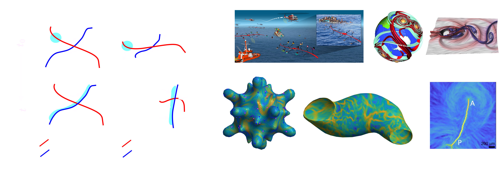

## What are Coherent Structures?

Coherent Structures are persistent, robust structures in a flow that summarize complex fluid trajectories and material deformations [1]. Lagrangian Coherent Structures (LCSs) [1] summarize material transport over a finite time interval. Eulerian Coherent Structures [2], on the other hand, do so over short-time intervals. There exist different methods for computing Coherent Structures from velocity or trajectory flow data (see, e.g., [3]). Here, we focus on Attracting and Repelling Coherent Structures---special material surfaces in 3D flows or curves in 2D flows where nearby tracer particles maximally converge or separate. We identify Attracting and Repelling Coherent Structures based on the Finite Time Lyapunov Exponent (FTLE) and instantaneous Lyapunov Exponents [4] fields, which are the most common due to their simplicity and straightforward visualization. 

<figure>

<figcaption>(a) Deformation of a fluid patch close to a saddle point (i.e., a fixed point) of a steady velocity (v(x)) (left), and to Attracting and repelling LCSs in an unsteady velocity v(x,t) (right). 
Attracting and Repelling Coherent Structures are special material surfaces in 3D flows or curves in 2D flows where nearby tracer particles maximally converge or separate. (b-i) Examples of Coherent Structures in physical and biological flows. (b) Short-time attractors (or Attracting Eulerian Coherent Structures) aid search and rescue operations at sea [Ref]. (c) Attracting and Repelling LCSs in atmospheric flows [Ref]. (d) WRITE what it is and replace it with laboratory flow [REF]. (e) FTLE and Attracting LCSs in active nematic flows [REF]. (f) FTLE and Attracting LCSs in a beating zebrafish heart [ref]. (g) FTLE and Attracting LCSs in multicellular flows during avian gastrulation [ref].   
 </figure>

<!--  -->

## Why is coherent structure identification useful?
Consider the flow field around a saddle point (Panel (a)): a nearby patch of fluid (cyan) converges to the fixed point along its stable manifold (red curve) and separates along the unstable manifold (blue curve). Stable and unstable manifolds of saddle points, however, have important limitations: i) are meaningful only in steady velocities (v(x)); ii) describe the evolution of material patches only in the infinite-time limit (not over finite or short times); iii) are static (do not deform/move in time). Repelling and Attracting LCSs generalize stable and unstable manifolds of fixed points, overcoming the above limitations. i) They are computable for both steady and unsteady (v(x,t)) velocity fields; ii) they shape material patches over the desired time interval of interest [t_0, t_0+T]; iii) they are dynamic (move and deform over time); iv) they reveal regions on the flow with the highest Lagrangian deformations; v) they are objective; i.e., it is invariant to time-dependent rotations and translations of the coordinate system used to describe motion. 

Overall, Repelling and Attracting LCSs provide a reduced representation of a temporally and spatially varying flow, enabling robust quantification of complex and noisy velocity datasets, a systematic comparison between flows in different experiments and comparisons with theoretical models. Coherent structures also provide a simplified understanding of flow geometry, identify dynamic domain boundaries, and provide a new perspective for optimal flow control. Finite-Time-Lyapunov-Exponents enable identifying repelling and Attracting LCSs as ridges (or regions with high FTLE values) of a scalar field. While Coherent Structures were initially motivated to analyze atmospheric and oceanic flows, recent works have demonstrated their utility in studying biological systems and active matter (see panel (b) and [examples](./docs/FTLEinBiology) of recent papers). 

## How do we calculate FTLE?

We will now describe how to compute the FTLE for a 2D flow described by the velocity field $$\mathbf{v}(\mathbf{x},t)$$ were $$ \mathbf{x},\mathbf{v} \in \mathbb{R}^2$$. The formalism required to compute FTLE for flows on 2D curved surfaces embedded in 3D is different and we refer you to the paper [S. Santhosh et al]() for details.

>> In general, to experimentally compute the velocity field of a flow PIV methods are used (See [Ref](https://en.wikipedia.org/wiki/Particle_image_velocimetry), [PIVLab](https://pivlab.blogspot.com/p/blog-page_19.html) is a MATLAB toolbox to easily compute PIV). 

To study the Lagrangian features of the flow, we compute the flow map 

 
$$ \mathbf{F}_{t_0}^t(\mathbf{x}_0)  = \mathbf{x}_0 + \int_{t_0}^t \mathbf{v}(\mathbf{F}_{t_0}^\tau(\mathbf{x}_0),\tau) d\tau. $$

The FTLE is computed using the right Cauchy-Green strain tensor $$\mathbf{C}_{t_0}^t(\mathbf{x}_0) = (\mathbf{\nabla}_{\mathbf{x}_0}\mathbf{F}_{t_0}^t(\mathbf{x}_0))^\top(\mathbf{\nabla}_{\mathbf{x}_0}\mathbf{F}_{t_0}^t(\mathbf{x}_0)),$$
which quantifies the Lagrangian deformation experienced by a material patch initially at $$\mathbf{x}_0$$ over the time-interval $$[t_0,t]$$. The eigenvalues of the $$\mathbf{C}_{t_0}^t(\mathbf{x}_0)$$ are positive, since it is real and symmetric. The FTlE field is given by, 

$$ \Lambda_{t_0}^t(\mathbf{x}_0) = \frac{1}{2|t-t_0|}\text{log}(\lambda_2),$$
 

where $$\lambda_2$$ is the largest eigenvalue of $$\mathbf{C}_{t_0}^t(\mathbf{x}_0)$$.

<figure>

<figcaption> </figcaption>
</figure>

## References

[1] : Haller, G., 2015. Lagrangian coherent structures. Annual review of fluid mechanics, 47(1)

[2] : Serra, M., & Haller, G. (2016). Objective Eulerian coherent structures. Chaos: An Interdisciplinary Journal of Nonlinear Science, 26(5)

[3] : Hadjighasem, A., Farazmand, M., Blazevski, D., Froyland, G., & Haller, G. (2017). A critical comparison of Lagrangian methods for coherent structure detection. Chaos: An Interdisciplinary Journal of Nonlinear Science, 27(5).

[4] : Nolan, P. J., Serra, M., & Ross, S. D. (2020). Finite-time Lyapunov exponents in the instantaneous limit and material transport. Nonlinear Dynamics, 100(4), 3825-3852.

