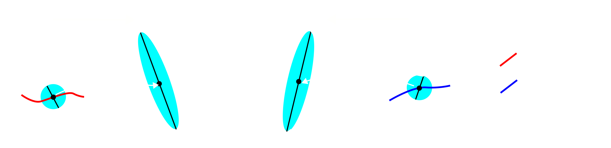

## What are Coherent Structures?

Coherent Structures are persistent, robust structures in a flow that summarize complex fluid trajectories and material deformations [1]. Lagrangian Coherent Structures (LCSs) [1] summarize material transport over a finite time interval. Eulerian Coherent Structures [2], on the other hand, do so over short-time intervals. Different methods have been proposed in the literature to compute these structures from flow data (see e.g. [3]). Here, we adopt Coherent Structures based on the Finite Time Lyapunov Exponent (FTLE) and instantaneous Lyapunov Exponents [4] fields, which are the most common due to their simplicity and straightforward visualization. 

The FTLE is computed from the Lagrangian deformation generated by the flow and is objective; i.e., it is invariant to time-dependent rotations and translations of the coordinate system used to describe motion. 
[NEED TO MODIFY THE FIGURE AND ADD INSTANTANEOUS ATTRACTORS / NAT COMM]

<figure>

<figcaption>(a) Attracting and Repelling LCSs are special material surfaces in 3D flows, or curves in 2D flows, that maximally attract or repel nearby tracer particles. (b) Examples of flow which has been analyzed using the LCS framework. </figcaption>
</figure>

<!--  -->

## Why is coherent structure identification useful?

The FTLE helps identify the finite-time analogues of the stable and unstable manifolds which are called hyperbollic coherent structures, thereby providing a reduced representation of a temporally and spatially varying flow (See panel (a) in figure above). The reduced representation therefore enables a systematic comparison between flows in different experimental setups and with different theoretical model of the flow. Coherent structures also provides a simplified understanding of the flow geometry, which aids in the study of funtion of flows generated, such as in morphogenesis where material transport is important.

Though FTLE was developed to analyze atmospheric and oceanic flows, recent work have demonstrated the usefulness of analyzing active flows generated by biological systems through a coherent structures framework (See panel (b) in figure above). See the [link](./docs/FTLEinBiology) for a detailed list of papers using the ideas of coherent structures in addressing questions in biology. Simarly the there has been recent advances in understanding active nematic systems using flow structures (See [link](./docs/FTLEinActiveSystems) for a list of papers), which we expect to increase going forward.

## How do we calculate FTLE?

We will now describe how to compute the FTLE for a 2D flow described by the velocity field $$\mathbf{v}(\mathbf{x},t)$$ were $$ \mathbf{x},\mathbf{v} \in \mathbb{R}^2$$. The formalism required to compute FTLE for flows on 2D curved surfaces embedded in 3D is different and we refer you to the paper [S. Santhosh et al]() for details.

>> In general, to experimentally compute the velocity field of a flow PIV methods are used (See [Ref](https://en.wikipedia.org/wiki/Particle_image_velocimetry), [PIVLab](https://pivlab.blogspot.com/p/blog-page_19.html) is a MATLAB toolbox to easily compute PIV). 

To study the Lagrangian features of the flow, we compute the flow map 

 
$$ \mathbf{F}_{t_0}^t(\mathbf{x}_0)  = \mathbf{x}_0 + \int_{t_0}^t \mathbf{v}(\mathbf{F}_{t_0}^\tau(\mathbf{x}_0),\tau) d\tau. $$

The FTLE is computed using the right Cauchy-Green strain tensor $$\mathbf{C}_{t_0}^t(\mathbf{x}_0) = (\mathbf{\nabla}_{\mathbf{x}_0}\mathbf{F}_{t_0}^t(\mathbf{x}_0))^\top(\mathbf{\nabla}_{\mathbf{x}_0}\mathbf{F}_{t_0}^t(\mathbf{x}_0)),$$
which quantifies the Lagrangian deformation experienced by a material patch initially at $$\mathbf{x}_0$$ over the time-interval $$[t_0,t]$$. The eigenvalues of the $$\mathbf{C}_{t_0}^t(\mathbf{x}_0)$$ are positive, since it is real and symmetric. The FTlE field is given by, 

$$ \Lambda_{t_0}^t(\mathbf{x}_0) = \frac{1}{2|t-t_0|}\text{log}(\lambda_2),$$
 

where $$\lambda_2$$ is the largest eigenvalue of $$\mathbf{C}_{t_0}^t(\mathbf{x}_0)$$.

<figure>

<figcaption> </figcaption>
</figure>

## References

[1] : Haller, G., 2015. Lagrangian coherent structures. Annual review of fluid mechanics, 47(1)

[2] : Serra, M., & Haller, G. (2016). Objective Eulerian coherent structures. Chaos: An Interdisciplinary Journal of Nonlinear Science, 26(5)

[3] : Hadjighasem, A., Farazmand, M., Blazevski, D., Froyland, G., & Haller, G. (2017). A critical comparison of Lagrangian methods for coherent structure detection. Chaos: An Interdisciplinary Journal of Nonlinear Science, 27(5).

[4] : Nolan, P. J., Serra, M., & Ross, S. D. (2020). Finite-time Lyapunov exponents in the instantaneous limit and material transport. Nonlinear Dynamics, 100(4), 3825-3852.

